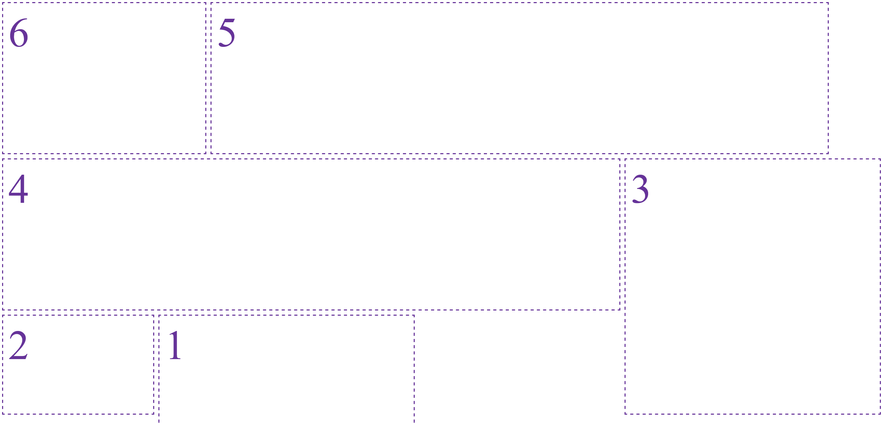

# koelapkak.js

A small JavaScript lib that helps you position DOM elements inside a container. The algorithm(s) try to position each element in a way so no other elements will be overlapped. 



Written in TypeScript without further dependencies.

## Install
```
npm install koelapkak.js
```

## Usage

Add a container element to your html.
The container should have one of the following css position values:
"absolute", "fixed", "relative", "sticky".

```html
<div id="container"></div>
```

Initialize koelapkak lib for the container.
```js
import { Koelapkak } from "koelapkak";

Koelapkak.init('#container');
```

Now each DOM element entering that container will be positioned by the default positioning algorithm;
The same applies for all elements that are already present inside the container.
